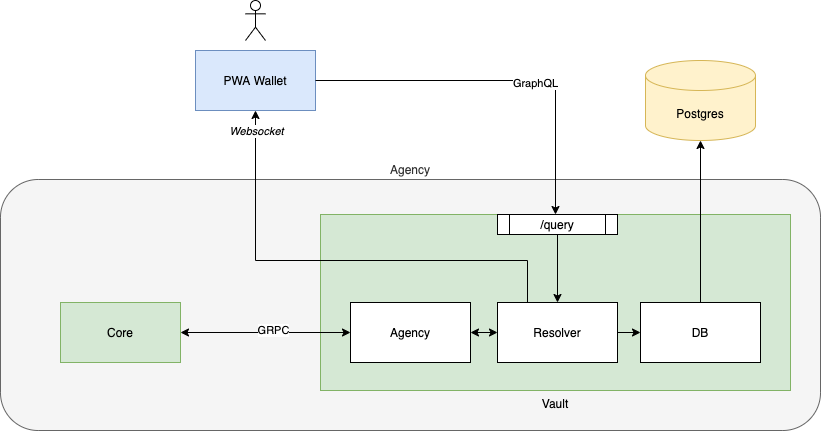

# findy-wallet-pwa

Web based cloud wallet for Findy agents. Uses WebAuthn / Fido2 for authentication.

## General architecture

Wallet related to the general architecture




## Running in development mode

1. Install and run Findy Vault: https://github.com/findy-network/findy-agent-vault/
2. Install Findy Wallet PWA
   ```
   npm install
   ```
3. Run application
   ```
   npm start
   ```

- This will launch the service at: http://localhost:3000
- You can access the service with a web browser when the Vault is running in background

## Wallet features

Here is listed some of the features the current version of this web wallet have.
Bare in mind that the features and how they work can change in the future.

### Register/Login

Web wallet uses passwordless WebAuthn / Fido2 authentication for the registration and login.
You must to have biometric authentication or hardware token available in order to make succesful registration/login.
More info here https://webauthn.io/

### Chat

In chat view you can send and receive messages, make proofs and receive credentials with other agents which you have connected with.

#### Connection

In order to make a connection with other agent, you have to scan qr-code invitation or paste invitation json provided by the other agent.
Press "Add connection" button to scan or paste invitation with your web wallet.
Connection request is sent when you press the "confirm" button. It can take several secounds to complete connection request.

#### Invitation

You can generate your own invitation json by pressing the "New invitation" button. You can share generated json with the agent who wants to make connection with you.

#### Messaging

When you successfully made a connection with other agent, you can send and receive messages within the connection.

#### Credential Offer

After you have a connection with other agent, they can send you verified credentials. You can accept or decline these offers.

#### Wallet credentials

You can browse your received credentials by going in the "Wallet" section of the app.

#### Proof Request

In chat view you can also receive proof requests. You must have proper credential in your wallet in order to accept the proof. You can also decline the request.
The app will tell you if you have the suitable credentials to accept the proof request or not.

## Release new version

1. Checkout latest from dev branch.
1. Run
   ```
   ./tools/release.sh
   ```
