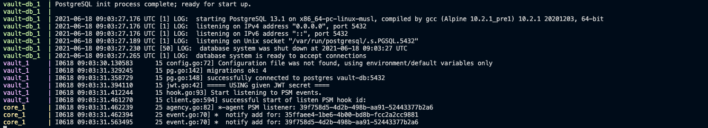
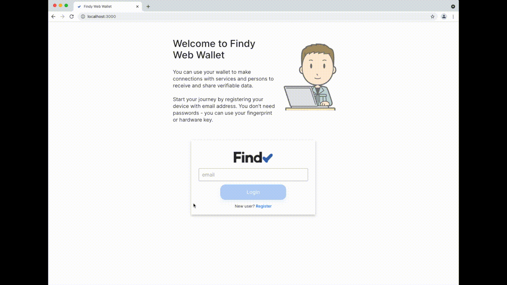
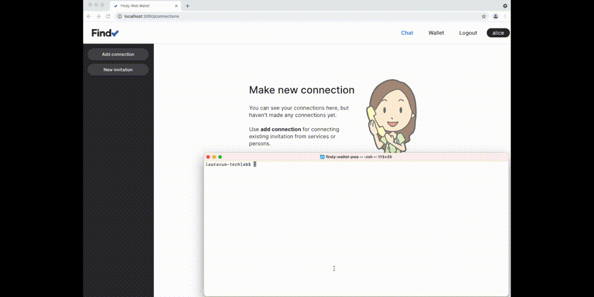
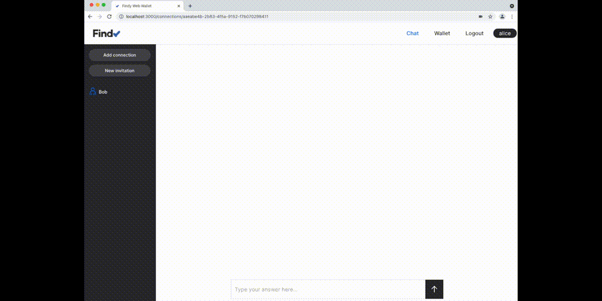
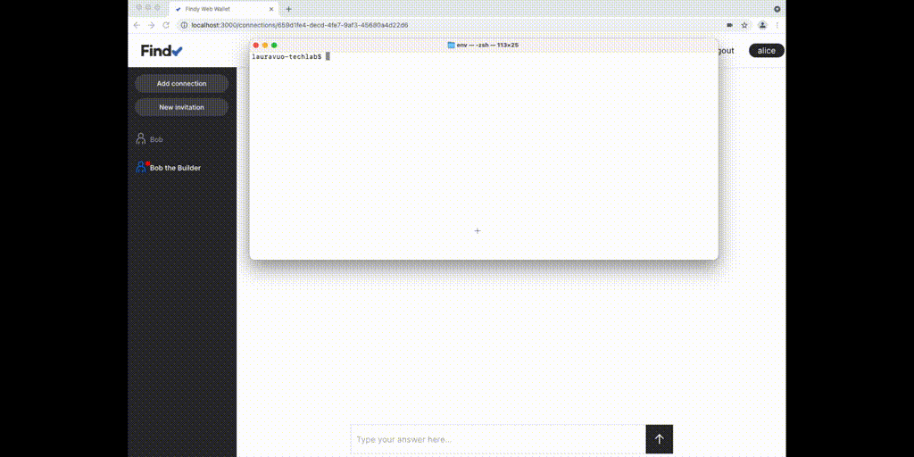
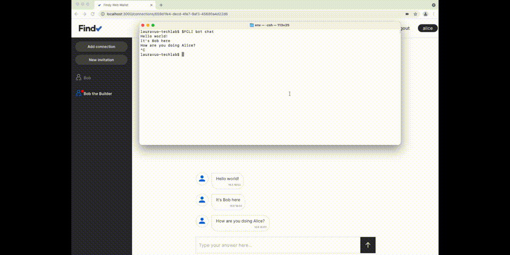

# Agency Setup for Local Development

## Description

In case you do not have cloud installation of Findy Agency available, you can
setup needed services locally and develop your application against a local Findy
Agency. This document describes how to set up Findy Agency service containers on
your local computer.

The setup uses agency internal file ledger, intended only for testing during
development. This setup does not suit for testing inter-agency communication
even though it is possible to set one up using a common indy-plenum ledger.

The steps below describe how to setup full Findy agency installation. It also
shows how web wallet users can connect with other agents that are operated through findy-agent-cli tool.

**Note:**

- This documentation does not intend to teach readers theoretical background or other aspects of SSI technology. For that, we recommend excellent material crafed by other authors:
  - [Self-Sovereign Identity (book)](https://www.manning.com/books/self-sovereign-identity) by Alex Preukschat and Drummond Reed
  - [Developing Blockchain-Based Identity Applications (course)](https://www.edx.org/professional-certificate/linuxfoundationx-developing-blockchain-based-identity-applications) by Stephen Curran and Carol Howard
- The following steps describe only initial steps for getting things going with Findy agency. Read more about getting started with service agents from the blog:

  - [Getting Started with SSI Service Agent Development](https://findy-network.github.io/blog/2023/01/30/getting-started-with-ssi-service-agent-development/)
  - [How to Equip Your App with VC Superpowers](https://findy-network.github.io/blog/2023/02/06/how-to-equip-your-app-with-vc-superpowers/)

- The full test case is executed solely on your local computer and no data is sent to external services (including the authentication keys created during the registration).

## Prerequisities

- [Docker](https://www.docker.com/products/docker-desktop)
- [Node.js](https://nodejs.org/en/download/)
- [findy-agent-cli](https://github.com/findy-network/findy-agent-cli#installation)

## Steps

1. Install [prerequisities](#prerequisities) including [findy-agent-cli](https://github.com/findy-network/findy-agent-cli#installation). Make sure [Docker daemon](https://docs.docker.com/config/daemon/) is running.

1. Clone this repository:

   ```sh
   git clone https://github.com/findy-network/findy-wallet-pwa.git
   ```

1. **Launch backend services**

   Open terminal and run:

   ```sh
   cd tools/env
   make pull-up
   ```

   This will pull the latest versions of the needed docker images. Later on when
   launching the backend you can use `make up` if there is no need to fetch the
   latest images.

   It will take a short while for all the services to start up. Logs from all of
   the started services are printed to the console. `C-c` stops the
   containers.

   When the init sequence is complete, you should see something similar to this output:
   

   The script will create a folder called `.data` where all the data of the
   services are stored during execution. If there is no need for the test data
   anymore, `make clean` will remove all the generated data and allocated
   resources.

1. **Start wallet development environment.**

   Open terminal on the root of this repository, run `npm install` and `npm start`. Wallet application is launched and you can access the service with browser in address <http://localhost:3000>

1. **Register Alice's Web-Wallet**

   Register the first wallet holder by the name Alice. In this registration phase you setup [the passwordless authentication](https://github.com/findy-network/findy-wallet-pwa#registerlogin) for this user. You can also use [emulated authenticators](https://developer.chrome.com/docs/devtools/webauthn/) if preferred.

   

   Now you have the agency services up and running and you have onboarded the first wallet user.

   Note: you can register only one user per username. If you wish to register another user, choose a different username.

1. **Build playground environment with CLI tool.**

   Open new terminal window and move to this folder:

   ```sh
   cd tools/env
   ```

   [Install](https://github.com/findy-network/findy-agent-cli#installation) findy-agent-cli if you haven't done it already. CLI can be used to register and operate other agents that can interact with your web wallet user.

   Make sure `findy-agent-cli` is in your path or define env variable `FCLI` that points to your CLI binary:

   ```sh
   export FCLI=<your-name-for-binary>

   # example
   export FCLI=$PWD/bin/findy-agent-cli
   ```

   Enter the following command to setup the CLI for the currently running local agency:

   ```sh
   source ./setup-cli-env.sh
   ```

   Note:

   - use the same terminal when running CLI from now on
   - **For Linux only**: define following aliases and install `xclip` if not
     already installed:

     ```sh
     alias pbcopy="xclip -selection c"
     alias pbpaste="xclip -selection clipboard -o"
     ```

   - [more tips, features and details](https://github.com/findy-network/findy-agent-cli/tree/master/scripts/fullstack#steps) for this setup

1. **Onboard Bob (terminal)**

   Alice is already registered thru Web UI. Register Bob (agent operated through CLI) by entering this to the same terminal as in previous step:

   ```sh
   source bob/register
   ```

   Now you have onboarded two agents to agency, "Alice" with the web wallet and "Bob" through CLI tool.

1. **Bob invites Alice to connect...**

   ```sh
   # Authenticate Bob
   source bob/login

   # Create invitation for Bob and copy it to clipboard
   $FCLI agent invitation --label Bob | pbcopy
   ```

   Open Alice's web wallet and paste invitation to the add connection dialog.

   

   Optionally, define `FCLI_CONN_ID` variable:

   ```sh
   # if you want to chat using this connection,
   # you can skip next step and define FCLI_CONN_ID:
   # copy connection id from wallet URL
   # http://localhost:3000/connections/<new_id>
   export FCLI_CONN_ID=<new_id>
   ```

1. **...or Alice invites Bob to connect**

   Create invitation for Alice in the web UI. Copy it to the clipboard.

   Enter following command to the terminal:

   ```sh
   export FCLI_CONN_ID=`pbpaste | bob/connect`
   ```

   

1. **Bob sends Alice message**

   Now you have the connection ID (pairwise ID) in the environment variable. That enables you to start messaging to Alice:

   ```sh
   $FCLI bot chat
   ```

   Exit chat with C-c

   

1. **Alice sends text message to Bob**

   Enter following in Bob's terminal to start listening to messages:

   ```sh
   $FCLI bot read
   ```

   Go to the Alice's web wallet and send text message to "Bob the Builder."

   Bob's terminal should output Alice's welcoming messages. To stop Bob's
   listen command just press C-c.

   

1. **All done!**

   Congratulations, you just completed the initial Findy agency crash course! You can now continue experiments by
   - trying to run [the Alice-Faber-Acme demo](https://github.com/findy-network/findy-agency-demo#findy-agency-demo)
   - starting to [build a service agent of your own](https://findy-network.github.io/docs/getting-started/service-agent/)
   - or you can play around with the credentials using the tools: CLI tool [findy-agent-cli](https://findy-network.github.io/docs/getting-started/setup-agency/#cli) or UI tool [findy-issuer-tool](https://findy-network.github.io/docs/getting-started/setup-agency/#ui-tool)
